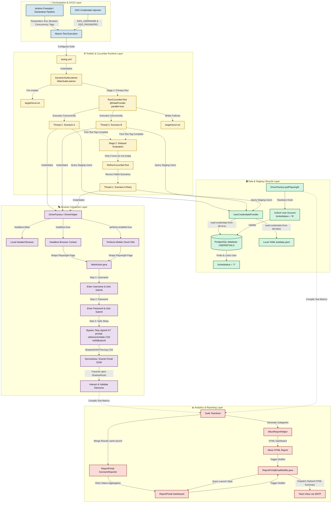
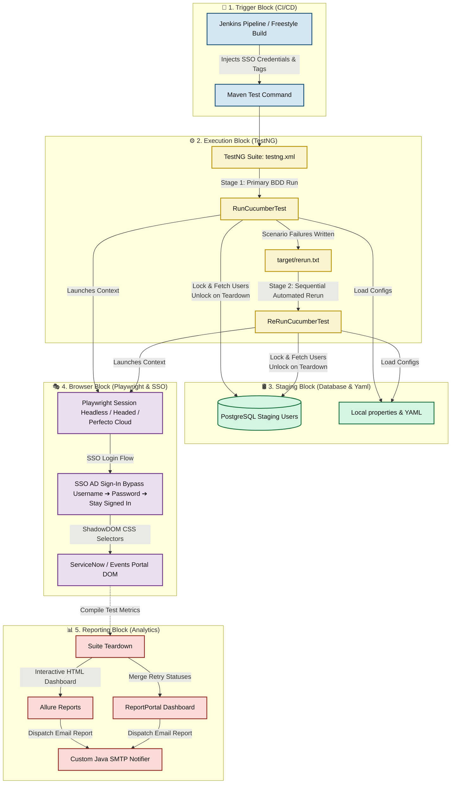

# 🗺️ Framework Map — Dbvi Playwright Cucumber BDD Framework

This is the single reference for how the repository is put together: directory/package layout, runtime architecture, data flow, and known security caveats. Start here before extending the framework; see [README.md](README.md) for setup/run instructions and [CLAUDE.md](CLAUDE.md) for AI-assistant conventions.

---

## 1. Directory & Package Map

```text
dbvi-enterprise-bdd-cucumber-playwright/
├── pom.xml                                   # Maven coordinates + dependency versions
├── testng.xml                                # Primary TestNG suite (RunCucumberTest)
├── testng-rerun.xml                          # Standalone rerun suite (ReRunCucumberTest)
├── Jenkinsfile                               # Declarative CI/CD pipeline
├── README.md                                 # Setup, config, and CLI usage guide
├── FRAMEWORK_MAP.md                          # This file
├── CLAUDE.md                                 # AI-assistant conventions for extending the framework
└── src/
    ├── main/java/com/dbvi/automation/
    │   ├── framework/
    │   │   ├── config/FrameworkProperties.java        # Central properties loader (system prop > config.properties > default)
    │   │   ├── factory/
    │   │   │   ├── DriverFactory.java                 # ThreadLocal Playwright/Browser/Context/Page + active credentials
    │   │   │   └── DriverHelper.java                  # Local/Grid/Perfecto browser bring-up (package-private)
    │   │   ├── loggers/
    │   │   │   ├── ConsoleLogger.java                  # System.out sink
    │   │   │   └── ReportLogger.java                   # Fan-out: TestNG Reporter + ReportPortal + Allure + Console
    │   │   ├── perfecto/
    │   │   │   ├── PerfectoReporter.java               # Perfecto Smart Reporting via page.evaluate()
    │   │   │   └── PerfectoReportingPlugin.java        # Cucumber ConcurrentEventListener -> step start/end
    │   │   ├── runner/
    │   │   │   ├── RunCucumberTest.java                # Primary parallel Cucumber/TestNG runner
    │   │   │   ├── ReRunCucumberTest.java              # Reruns only scenarios listed in rerun.txt
    │   │   │   └── DynamicSuiteListener.java           # IAlterSuiteListener: injects the rerun <test> block at runtime
    │   │   ├── utils/
    │   │   │   ├── EncryptionUtil.java                 # PBEWithMD5AndDES encrypt/decrypt (see Security Notes)
    │   │   │   ├── TestData.java                       # Dot-notation YAML lookup (env/{project}/{env}/*.yaml)
    │   │   │   ├── TotpUtil.java                       # Google Authenticator TOTP code generation
    │   │   │   ├── AllureReportHelper.java              # Writes environment.properties + categories.json at teardown
    │   │   │   ├── ReportPortalEmailNotifier.java       # Standalone JVM process: RP stats -> HTML email via SMTP
    │   │   │   └── testdata/
    │   │   │       └── UserCredentialsProvider.java     # DB user lock/unlock lifecycle, YAML fallback
    │   │   └── wrapper/ui/WebAction.java                # Fluent, auto-waiting Playwright action wrapper
    │   └── pages/
    │       ├── BasePage.java                            # webAction instance, getPage(), sleep(), loader-wait helper
    │       └── example/HomePage.java                    # Minimal reference Page Object (navigate + getBodyText)
    └── test/
        ├── java/com/dbvi/automation/steps/
        │   ├── ExampleSteps.java                        # Steps backing the only active feature: test.feature
        │   └── Hooks.java                                # @Before/@AfterStep/@After lifecycle
        └── resources/
            ├── config.properties                        # All runtime switches (browser, env, DB, SSO, Perfecto, email)
            ├── reportportal.properties                  # RP endpoint/project/API key
            ├── allure.properties / allure/categories.json
            ├── features/test.feature                    # Generic working example (example.com)
            └── env/example/{QA,QA1,UAT}/testdata.yaml
```

**Multi-project isolation convention**: every new business application gets its own folder name (e.g. `example` and `dbvi` — both shipped — or any name you choose) reused consistently across four places — `pages/{project}/`, `steps/{project}/`, `features/{project}/`, and `env/{project}/{env}/testdata.yaml`. `project-name` in `config.properties` selects which one `TestData` and CI target. The prior `dsp`/`events` business modules were removed as client-specific.

---

## 2. Detailed Architecture Diagram



### Layer definitions

1. **🚀 Orchestration Layer**: Jenkins triggers the pipeline, passing environment variables, thread concurrency limits, and SSO credentials securely as masked parameters.
2. **⚙️ Runtime Layer**: TestNG initiates. `DynamicSuiteListener` pre-creates an empty `rerun.txt` to prevent classloader crashes and sequences the primary run and the rerun under two separate `<test>` blocks.
3. **🛢️ Data Layer**: Staging accounts are dynamically fetched and locked in PostgreSQL at test startup and safely unlocked during teardown (`quitPlaywright()`).
4. **🎭 Browser Interaction Layer**: Playwright spins up headed, headless, or Perfecto cloud sessions. `WebAction` handles SSO logins, waits for dynamic redirects, and pierces nested Shadow DOM elements natively using CSS selectors.
5. **📊 Reporting Layer**: Allure packages failures with screenshots/videos, ReportPortal merges rerun retry results inside the active launch session, and a post-suite SMTP process dispatches HTML reports to stakeholders.

---

## 3. High-Level Lifecycle (Simplified View)



---

## 4. Configuration Precedence

`FrameworkProperties.getProperty(key, default)` resolves in this order:

1. JVM system property (`-Dkey=value`, e.g. from a Jenkins `mvn` invocation)
2. `src/test/resources/config.properties`
3. Hard-coded default in `FrameworkProperties.java`

`TestData.get("a.b.c", Type.class)` is a separate, unrelated mechanism: it resolves `env/{project-name}/{env}/testdata.yaml` (both driven by `config.properties`) and does dot-notation traversal into the parsed YAML map.

---

## 5. Security Notes

These are pre-existing characteristics of the framework worth knowing before you reuse or publish this repository further:

- **`EncryptionUtil.java` uses a hardcoded PBE key and salt** committed in source (`PASSWORD`/`SALT` constants). This provides *obfuscation*, not real confidentiality — anyone with read access to the repository can decrypt any `db.password` value. Treat `db.password` as visible plaintext for access-control purposes; do not rely on it to gate database access.
- **`config.properties`, `reportportal.properties` previously held live-looking secrets** (a Perfecto JWT, an encrypted DB password, a personal ReportPortal API key) committed directly to the file. They have been replaced with placeholders (`YOUR_PERFECTO_TOKEN`, `YOUR_ENCRYPTED_DB_PASSWORD`, `YOUR_REPORTPORTAL_API_KEY`). If those original values reached a shared git remote, rotate them and consider scrubbing history (e.g. `git filter-repo`) — replacing the working-tree file alone does not remove them from prior commits.
- **Recommended direction**: move `db.password`, `perfecto.token`, `rp.api.key`, and SSO credentials to environment variables or a secrets manager injected at CI time (Jenkins credentials binding), rather than checked-in properties files, even with placeholders as the committed default.

---

## 6. Extending the Framework

To add a new project module (e.g. `myproject`) — see the `dbvi` module (`pages/dbvi/LoginPage.java` + `steps/dbvi/LoginSteps.java` + `features/dbvi/login.feature` + `env/dbvi/QA/`) for a real, working reference:

1. Create `src/main/java/com/dbvi/automation/pages/myproject/` — one class per page, selectors as `private static final String`, actions + AssertJ assertions in the same class (Single-Class POM).
2. Create `src/test/java/com/dbvi/automation/steps/myproject/` — assertion-free step definitions delegating to the page objects.
3. Create `src/test/resources/features/myproject/*.feature`.
4. Create `src/test/resources/env/myproject/{env}/testdata.yaml`.
5. Run with `mvn clean test -Dproject-name=myproject -Dcucumber.filter.tags="@MYPROJECT_REGRESSION"`.

See [CLAUDE.md](CLAUDE.md) for the full step-by-step authoring workflow and quality checklist.
